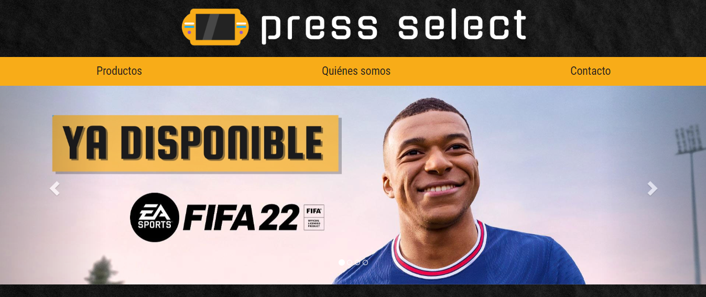
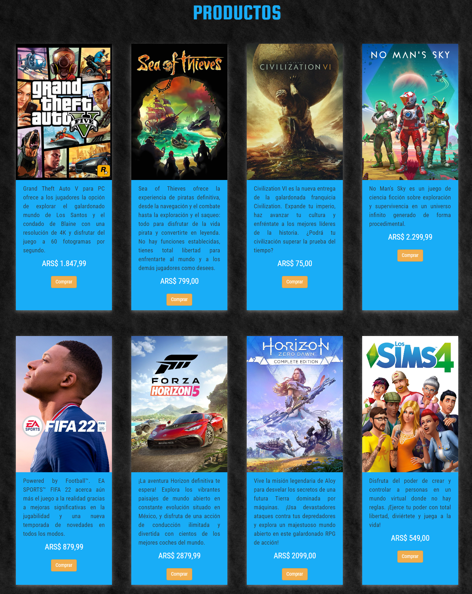
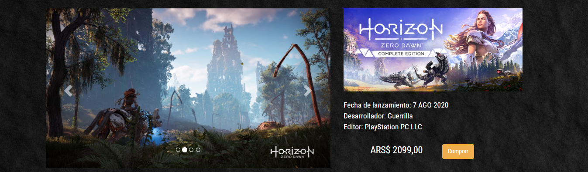
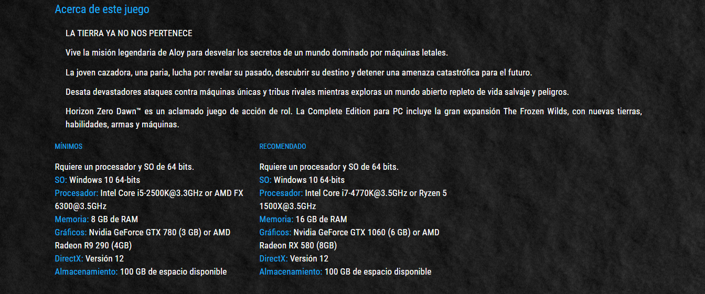
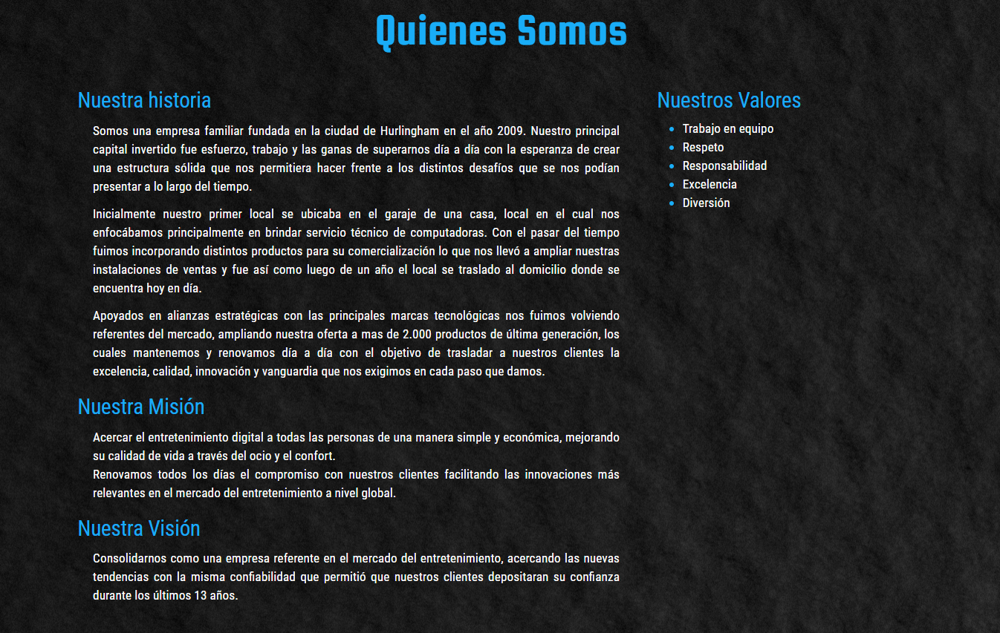
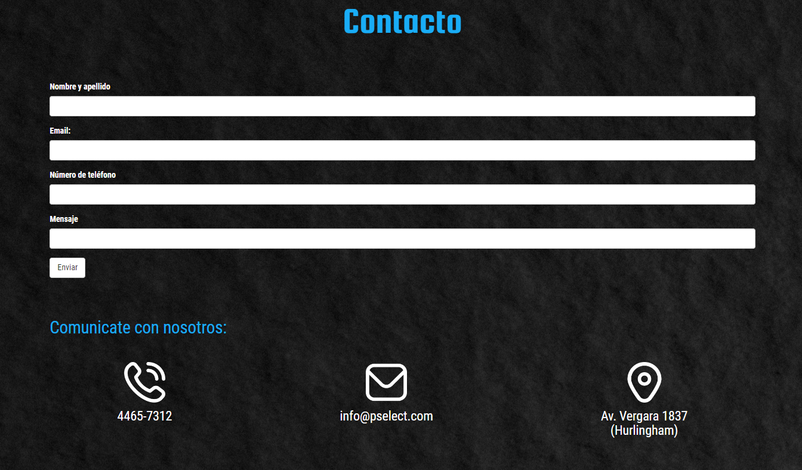

# Web Press Select
## Diseño y desarrollo de web.

## Introducción

A lo largo de este documento haremos un análisis del desarrollo de la web de Press Select, una empresa ficticia dedicada a la venta de videojuegos así como Steam o EpicGames. Para su creación autilicé Bootstrap 4.

## Página Web
#### Presentación
Al entrar encontramos el nombre de la empresa con su logo; una barra de navegación con los links a las páginas de la web y un carrusel que nos muestra las últimas novedades de sus videojuegos. 

#### Productos
Después contamos con una lista de productos. En ella tenemos su imagen de portada, la sinopsis del juego, su precio y un botón (sin funcionalidad) de comprar. Si hacemos click en alguna portada, nos redirige a la página del producto.

#### Página del juego
Si entramos en la página del juego, nos encontraremos primero con un carrusel que nos muestra algunas imágenes del juego. A la derecha tenemos su portada horizontal, algunos datos y nuevamente su precio y un botón de compra (sin funcionalidad).

Luego, más abajo contamos con una descripción del juego, seguido de los requisitos mínimos y los requisitos recomendados que tiene el juego en cuanto a componentes informáticos.

#### Quienes Somos
Si vamos al nav y hacemos click en "Quienes somos" nos redirigirá a la página de información de la empresa. Es bastante simple, ya que solo contiene su historia, su misión y visión y, a la derecha, algunos de los valores que tiene la misma.

#### Contacto
Si volvemos al nav y hacemos click en "Contacto" nos redirigirá a la página de contacto de la empresa. En ella tenemos un breve formulario para enviar un mail (sin funcionalidad) en caso de que se necesite. Además, se brindan datos de la empresa, como lo es su teléfono, mail y ubicación, diferenciados por sus iconos correspondientes.

#### Footer
Por último tenemos, debajo de todo, el footer en el que encontramos las distintas páginas de nuestra web, siendo estos links de redireccionamiento, y la información de contacto más pequeña. Este lo encontramos en todas las secciones de la web, por lo que siempre tendremos esa información a la disposición.

## Decisiones Técnicas
Toda la página cuenta con un diseño responsive, ya que cada vez se utilizan más distintos dispositivos para hacer compras online. Muchas cosas no tienen funcionalidad aún ya que no es una página de e-commerce real. Me enfoqué crear una web sencilla y entendible, en la que puedas navegar por las distintas secciones sin problema. A su vez, intenté mantener la información bien distribuída pero en la menor cantidad de secciones posibles, así el usuario no se siente abrumado con todas las posibilidades. 

## Decisiones visuales

La paleta de colores debía ser llamativa ya que estamos hablando de juegos electrónicos, por lo que mantener una estética de fondo negro con colores bastante saturados me pareció la más adecuada, imitando las luces de neón de los locales orientados a los videojuegos. En este caso elegí naranja y azul ya que son colores complementarios, y resaltan bastante bien del negro ya que son bastante luminosos. Además, usar el color naranja en el logo le daba bastante credibilidad al mismo, lo cual no ocurría con colores como el rosa.

La tipografía tenía que ser juvenil, pero que sea lo más legible posible. Por ello, elegí una que no se aleje mucho de la Arial o Sans serif, pero agregándole un poco más de curvas. 

El fondo imita un muro negro para resaltar mucho la sensación "Neón" de la paleta de colores, además de imitar a los locales que tienen este estilo. Este efecto es resaltado también en los productos, agregándole un brillo alrededor de los mismos.

## Conclusión

Así se logra conseguir una web íntegra, llamativa y útil. Es fácil conseguir lo que se busca, en este caso comprar los productos o contactarse con la empresa. Un formato sencillo y entendible para explorar juegos, aparte de bien diferenciado qué se necesita para el juego que esperas comprarte. De esta forma, se hace mucho más fácil elegir y comprar, siendo el botón bastante llamativo, tanto en la página principal como en la particular de cada producto.